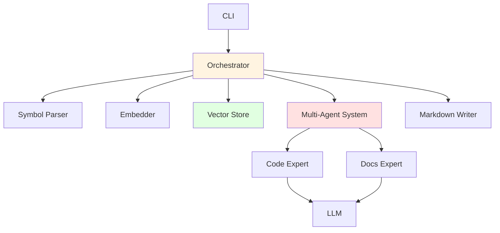

# Agentic-RAG for Markdown API Documentation

**Automatically generate high-quality Markdown API documentation from Python codebases using RAG and multi-agent LLMs.**

Agentic-RAG combines AST parsing, vector search, and intelligent agents to create comprehensive, maintainable API documentation that lives alongside your code. Unlike traditional documentation tools, it uses Retrieval-Augmented Generation (RAG) to understand code context and generate structured, clean Markdown with idempotent updates.

[](https://www.python.org/downloads/)
[](https://opensource.org/licenses/MIT)

---

## ✨ Features

- **🤖 Multi-Agent Architecture**: Code Expert analyzes structure, Docs Expert generates clean Markdown
- **🔍 Smart Context Retrieval**: RAG-powered documentation using vector search over your codebase
- **⚡ Parallel Generation**: Configurable worker pool for fast, concurrent documentation generation
- **🔒 Automatic Lock Management**: Self-healing Qdrant lock cleanup prevents concurrency issues
- **📊 Progress Tracking**: Real-time progress bars for parsing, indexing, and generation
- **🔄 Idempotent Updates**: Hash-based change detection preserves manual edits
- **🌐 Flexible LLM Support**: Use local GGUF models or API services (Ollama, OpenAI)
- **💾 Vector Database**: Qdrant integration with automatic retry and cleanup logic
- **🛡️ Signal Handling**: Graceful shutdown on interruption (Ctrl+C)
- **🎯 Clean Output**: Removes LLM "thinking" processes and ensures pure Markdown

---

## 🚀 Quick Start

### Installation

```bash
# Clone the repository
git clone https://github.com/yourusername/agentic-rag.git
cd agentic-rag

# Create virtual environment and install
python -m venv .venv
source .venv/bin/activate  # On Windows: .venv\Scripts\activate
pip install -e .
```

### Basic Usage

```bash
# 1. Index your codebase
agentic-docs index --root . --all

# 2. Generate documentation (with Ollama)
agentic-docs generate \
  --api \
  --model-path "qwen3:8b" \
  --api-base "http://localhost:11434/v1" \
  --workers 8

# 3. View generated docs
ls docs/api/
```

---

## 📖 Documentation

- **[Architecture](docs/architecture.md)** - System design and component details
- **[Configuration](#configuration)** - Environment variables and CLI options
- **[Examples](#examples)** - Common usage patterns

---

## 🏗️ Architecture



### Key Components

| Component | Description | Technology |
|-----------|-------------|------------|
| **Parser** | AST-based symbol extraction | Python `ast` module |
| **Embedder** | Text-to-vector encoding | Sentence Transformers |
| **Vector Store** | Semantic search and storage | Qdrant (local/server) |
| **Code Expert** | Analyzes code structure | LangChain + LLM |
| **Docs Expert** | Generates Markdown | LangChain + LLM |
| **Writer** | Idempotent section updates | Custom implementation |

See the full [Architecture Documentation](docs/architecture.md) for details.

---

## ⚙️ Configuration

### Environment Variables

Create a `.env` file in the project root:

```bash
# LLM Configuration
LLM_IS_LOCAL=False              # Use API instead of local GGUF
LLM_MODEL_PATH=qwen3:8b         # Model name (API) or path (local)
LLM_API_BASE=http://localhost:11434/v1
LLM_API_KEY=ollama

# Performance
MAX_WORKERS=4                   # Parallel worker count

# Embedding
EMBED_MODEL=intfloat/e5-base-v2
DEVICE=cpu                      # or 'cuda' for GPU
```

### CLI Options

#### Index Command
```bash
agentic-docs index [OPTIONS]

Options:
  --root TEXT       Root directory to index (default: .)
  --all             Index all files (ignores git diff)
  --changed-only    Only index changed files
```

#### Generate Command
```bash
agentic-docs generate [OPTIONS]

Options:
  --changed-only        Only generate docs for changed symbols
  --dry-run            Show what would change without writing
  --write              Write documentation files
  --model-path TEXT    Model name (API) or path (local GGUF)
  --api                Use API-based LLM (Ollama/OpenAI)
  --api-base TEXT      API base URL
  --api-key TEXT       API key
  --workers INTEGER    Number of parallel workers (default: 4)
```

---

## 📚 Examples

### Using Local GGUF Model

```bash
# Download a model (e.g., using llama.cpp)
wget https://huggingface.co/.../model.gguf

# Generate with local model
agentic-docs generate \
  --model-path /path/to/model.gguf
```

### Using Ollama

```bash
# Start Ollama server
ollama serve

# Pull a model
ollama pull qwen3:8b

# Generate documentation
agentic-docs generate \
  --api \
  --model-path "qwen3:8b" \
  --api-base "http://localhost:11434/v1" \
  --workers 8
```

### Using OpenAI API

```bash
agentic-docs generate \
  --api \
  --model-path "gpt-4" \
  --api-base "https://api.openai.com/v1" \
  --api-key "your-api-key"
```

### Sequential Processing (Debug Mode)

```bash
# Use 1 worker for easier debugging
agentic-docs generate \
  --api \
  --model-path "qwen3:8b" \
  --api-base "http://localhost:11434/v1" \
  --workers 1
```

---

## 🔧 Development

### Project Structure

```
src/agentic_docs/
├── cli.py                 # CLI entry point
├── config.py              # Configuration management
├── agent/
│   ├── agents.py          # Multi-agent orchestration
│   └── orchestrator.py    # Pipeline manager
├── parsing/
│   └── symbols.py         # AST-based symbol extraction
├── index/
│   ├── embed.py           # Sentence-transformers wrapper
│   └── store_qdrant.py    # Qdrant vector store
├── llm/
│   ├── local_llm.py       # Local GGUF model wrapper
│   ├── api_llm.py         # API LLM wrapper
│   └── prompts.py         # Agent prompts
└── io/
    └── markdown_writer.py # Idempotent Markdown writer
```

### Running Tests

```bash
# Install development dependencies
pip install -e .[dev]

# Run tests
pytest tests/

# Code formatting
black src/
isort src/
```

---

## 🎯 How It Works

### 1. **Parsing**
- Scans Python files using AST
- Extracts symbols (classes, functions, methods)
- Computes content hashes for change detection

### 2. **Embedding & Indexing**
- Encodes symbol text to 768-dim vectors
- Stores in Qdrant vector database
- Enables semantic search over codebase

### 3. **Context Retrieval**
- Finds related symbols via vector similarity
- Provides context to LLM agents
- Ensures comprehensive documentation

### 4. **Multi-Agent Generation**
- **Code Expert**: Analyzes code structure and complexity
- **Docs Expert**: Generates clean, structured Markdown
- **Output Cleaning**: Removes thinking processes and code fences

### 5. **Idempotent Writing**
- Updates only changed sections
- Uses hash guards: `<!-- BEGIN: auto:symbol_id (hash=...) -->`
- Preserves manual edits outside guards

---

## 📊 Performance

### Typical Performance (68 symbols, 4 workers)

| Phase | Time | Speed |
|-------|------|-------|
| Parsing | ~2s | 34 symbols/s |
| Embedding | ~3s | 22 symbols/s |
| Retrieval | ~15s | 4.5 symbols/s |
| Generation | ~1m 23s | 1.2s/symbol |

**Tips for Optimization**:
- Increase `--workers` for faster generation (e.g., 8 or 16)
- Use GPU for embeddings: `DEVICE=cuda`
- Switch to server-mode Qdrant for concurrent retrieval
- Use faster models (smaller parameter count)

---

## 🛠️ Troubleshooting

### Qdrant Lock Error

If you see `RuntimeError: Storage folder .qdrant is already accessed`:

```bash
# The system auto-cleans locks, but you can force it:
pkill -9 -f agentic-docs
find .qdrant -name "*.lock" -delete
```

**Note**: The latest version includes automatic lock cleanup and retry logic.

### Slow Generation

```bash
# Check worker count
agentic-docs generate --workers 8  # Increase workers

# Use a faster model
agentic-docs generate --model-path "qwen3:4b"  # Smaller model
```

### LLM Output Issues

If documentation contains "thinking" or code fences:

- The system automatically cleans `<think>` tags and markdown fences
- If issues persist, update `src/agentic_docs/llm/prompts.py` with stronger constraints

---

## 🗺️ Roadmap

### Completed ✅
- [x] AST-based parsing with metadata extraction
- [x] Qdrant vector store integration
- [x] Multi-agent LLM architecture
- [x] Parallel generation with ThreadPoolExecutor
- [x] Automatic lock cleanup and retry logic
- [x] Progress bars for user feedback
- [x] Signal handlers for graceful shutdown
- [x] Support for local and API LLMs
- [x] Idempotent Markdown writer

### Planned 🔜
- [ ] Incremental updates (hash-based change detection)
- [ ] Server-mode Qdrant for true concurrent access
- [ ] Dependency graph for impact analysis
- [ ] MkDocs integration and publishing
- [ ] Multi-language support (JavaScript, TypeScript, Go)
- [ ] Custom documentation templates
- [ ] GitLab/GitHub CI/CD workflows
- [ ] Evaluation harness with baselines

---

## 📜 License

MIT License - see [LICENSE](LICENSE) for details.

---

## 🙏 Acknowledgements

This project builds on ideas from:
- Repository agents and code-aware RAG systems
- LangChain for LLM orchestration
- Sentence Transformers for embeddings
- Qdrant for vector search

---

## 📞 Support

- **Issues**: [GitHub Issues](https://github.com/yourusername/agentic-rag/issues)
- **Discussions**: [GitHub Discussions](https://github.com/yourusername/agentic-rag/discussions)
- **Documentation**: [docs/architecture.md](docs/architecture.md)

---

**Built with ❤️ by the Agentic-RAG Team**
