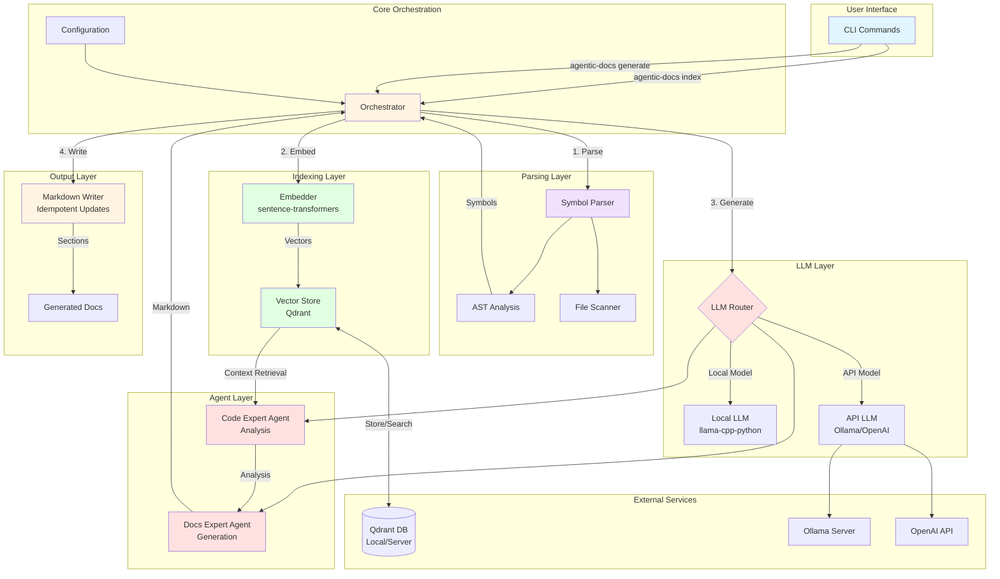
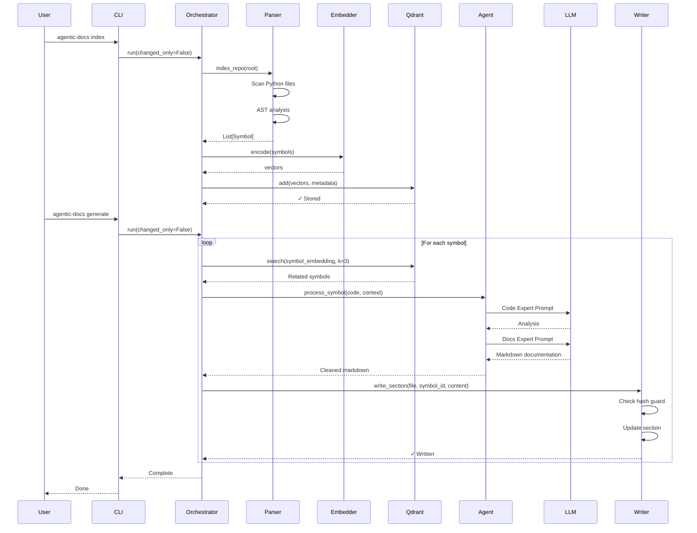
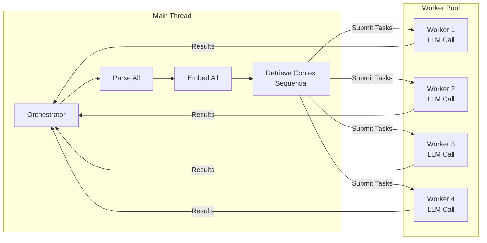

# Agentic-RAG Architecture

## System Overview

Agentic-RAG is an automated documentation generation system that uses RAG (Retrieval-Augmented Generation) with multi-agent LLMs to create high-quality Markdown API documentation from Python codebases.

## Architecture Diagram



## Data Flow



## Component Details

### 1. **CLI Layer** (`cli.py`)
- Entry point for user commands
- Handles command-line arguments
- Manages configuration overrides
- Commands: `index`, `generate`

### 2. **Orchestrator** (`agent/orchestrator.py`)
- **Core pipeline manager**
- Coordinates all components
- Manages parallel execution
- Handles cleanup and signals
- **Key Features**:
  - ThreadPoolExecutor for parallel generation
  - Automatic Qdrant lock cleanup
  - Progress bars via tqdm
  - Signal handlers (SIGINT/SIGTERM)

### 3. **Parsing Layer** (`parsing/symbols.py`)
- **Symbol Parser**: Extracts code symbols via AST
- **Metadata Extraction**:
  - Function/class signatures
  - Docstrings
  - Decorators
  - Line ranges
  - File paths
  - Content hashes (SHA-256)

### 4. **Indexing Layer**
- **Embedder** (`index/embed.py`):
  - Uses `sentence-transformers` (e5-base-v2)
  - Encodes text to 768-dim vectors
  - In-memory caching
  
- **Qdrant Store** (`index/store_qdrant.py`):
  - Local disk-based vector DB
  - Automatic retry with lock cleanup
  - Context manager support
  - Cosine similarity search

### 5. **LLM Layer**
- **Local LLM** (`llm/local_llm.py`):
  - Wraps `llama-cpp-python`
  - Supports GGUF models
  - Configurable context size and GPU layers
  
- **API LLM** (`llm/api_llm.py`):
  - Wraps `langchain-openai`
  - Compatible with Ollama and OpenAI
  - Configurable base URL and API key

### 6. **Agent Layer** (`agent/agents.py`)
- **Code Expert Agent**:
  - Analyzes code structure
  - Identifies key concepts
  - Determines complexity
  
- **Docs Expert Agent**:
  - Generates clean Markdown
  - Uses retrieved context
  - Structured output (no thinking tags)
  - Follows documentation standards

### 7. **Output Layer** (`io/markdown_writer.py`)
- **Markdown Writer**:
  - Idempotent section updates
  - Hash-based change detection
  - Preserves manual edits
  - Section guards: `<!-- BEGIN: auto:symbol_id -->`

## Configuration

### Environment Variables
```bash
# LLM Configuration
LLM_IS_LOCAL=False
LLM_MODEL_PATH=qwen3:8b
LLM_API_BASE=http://localhost:11434/v1
LLM_API_KEY=ollama

# Performance
MAX_WORKERS=4

# Embedding
EMBED_MODEL=intfloat/e5-base-v2
DEVICE=cpu
```

### CLI Arguments
```bash
# Indexing
agentic-docs index --root . --all

# Generation
agentic-docs generate \
  --api \
  --model-path "qwen3:8b" \
  --api-base "http://localhost:11434/v1" \
  --workers 8 \
  --dry-run
```

## Concurrency Model



**Key Design Decisions**:
- **Qdrant access is sequential** (main thread only) to avoid lock contention
- **LLM generation is parallel** via ThreadPoolExecutor
- **Configurable worker count** (default: 4)
- **Automatic cleanup** on interruption

## Performance Characteristics

| Phase | Parallelization | Bottleneck |
|-------|----------------|------------|
| Parsing | Sequential | I/O (file reading) |
| Embedding | Batched | CPU/GPU (model inference) |
| Vector Search | Sequential | Qdrant lock |
| LLM Generation | Parallel | API/Model latency |
| Writing | Sequential | I/O (file writing) |

**Optimization Opportunities**:
- ✅ Parallel LLM generation (implemented)
- ✅ Progress bars for feedback (implemented)
- ⏳ Incremental indexing (hash-based change detection)
- ⏳ Server-mode Qdrant for concurrent access
- ⏳ Batch embedding for better GPU utilization

## Tech Stack

| Component | Technology |
|-----------|-----------|
| Language | Python 3.10+ |
| CLI Framework | Click |
| AST Parsing | Built-in `ast` module |
| Embeddings | Sentence Transformers |
| Vector DB | Qdrant (local/server) |
| LLM Orchestration | LangChain |
| Local LLM | llama-cpp-python |
| API LLM | OpenAI SDK |
| Progress Bars | tqdm |
| Configuration | pydantic-settings |

## File Structure

```
src/agentic_docs/
├── cli.py                 # CLI entry point
├── config.py              # Configuration management
├── agent/
│   ├── agents.py          # Multi-agent orchestration
│   └── orchestrator.py    # Pipeline manager
├── parsing/
│   └── symbols.py         # AST-based symbol extraction
├── index/
│   ├── embed.py           # Sentence-transformers wrapper
│   └── store_qdrant.py    # Qdrant vector store
├── llm/
│   ├── local_llm.py       # Local GGUF model wrapper
│   ├── api_llm.py         # API LLM wrapper
│   └── prompts.py         # Agent prompts
└── io/
    └── markdown_writer.py # Idempotent Markdown writer
```

## CI/CD Integration

### GitLab CI Pipeline
```yaml
stages:
  - index
  - propose
  - apply

index:
  script:
    - agentic-docs index --all

propose-docs:
  script:
    - agentic-docs generate --changed-only

apply-docs:
  script:
    - git add docs/
    - git commit -m "docs: update API documentation"
```

## Future Enhancements

1. **Incremental Updates**: Only re-generate changed symbols
2. **Server-Mode Qdrant**: Support concurrent access
3. **Streaming Output**: Show LLM generation in real-time
4. **Multi-Language Support**: Extend to JavaScript, TypeScript, Go
5. **Custom Templates**: User-defined documentation formats
6. **Context Window Management**: Automatic chunking for large files
